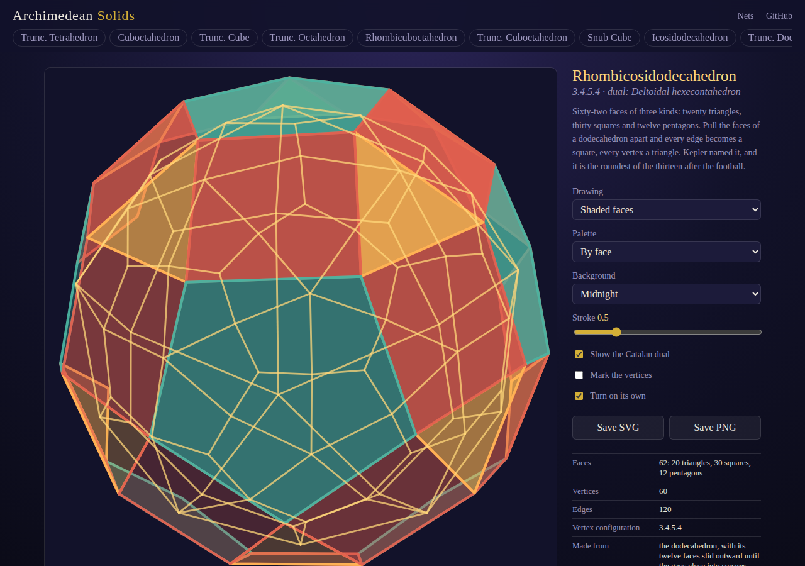
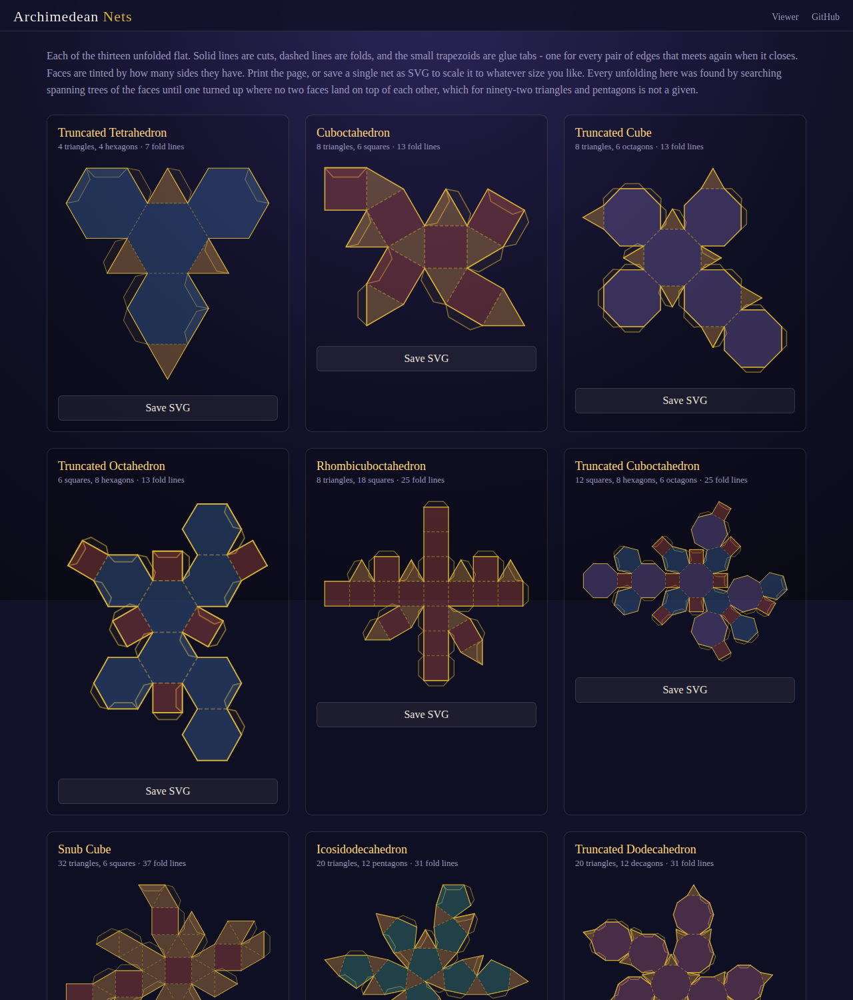

# Archimedean-Solids

Turn all thirteen Archimedean solids in 3D, show their Catalan duals, read their measurements, and print the nets to fold your own. Nothing is written down but the five Platonic seeds: every solid here is made from one of them, and everything else is derived.

- [Turn the solids](https://evoluteur.github.io/archimedean-solids/)
- [Print the nets](https://evoluteur.github.io/archimedean-solids/nets.html)

## The thirteen

A solid belongs here if every face is a regular polygon and every vertex looks like every other, but the faces are not all alike. That last clause rules out the Platonic five; the prisms and antiprisms, which go on forever, are set aside by convention. What is left is exactly thirteen. Archimedes described them in a book that has not survived — Pappus lists them as his — and Kepler rediscovered, completed and named them in 1619.

| Solid | Vertex | Faces | Dual |
|---|---|---|---|
| Truncated tetrahedron | 3.6.6 | 4 triangles, 4 hexagons | Triakis tetrahedron |
| Cuboctahedron | 3.4.3.4 | 8 triangles, 6 squares | Rhombic dodecahedron |
| Truncated cube | 3.8.8 | 8 triangles, 6 octagons | Triakis octahedron |
| Truncated octahedron | 4.6.6 | 6 squares, 8 hexagons | Tetrakis hexahedron |
| Rhombicuboctahedron | 3.4.4.4 | 8 triangles, 18 squares | Deltoidal icositetrahedron |
| Truncated cuboctahedron | 4.6.8 | 12 squares, 8 hexagons, 6 octagons | Disdyakis dodecahedron |
| Snub cube | 3.3.3.3.4 | 32 triangles, 6 squares | Pentagonal icositetrahedron |
| Icosidodecahedron | 3.5.3.5 | 20 triangles, 12 pentagons | Rhombic triacontahedron |
| Truncated dodecahedron | 3.10.10 | 20 triangles, 12 decagons | Triakis icosahedron |
| Truncated icosahedron | 5.6.6 | 12 pentagons, 20 hexagons | Pentakis dodecahedron |
| Rhombicosidodecahedron | 3.4.5.4 | 20 triangles, 30 squares, 12 pentagons | Deltoidal hexecontahedron |
| Truncated icosidodecahedron | 4.6.10 | 30 squares, 20 hexagons, 12 decagons | Disdyakis triacontahedron |
| Snub dodecahedron | 3.3.3.3.5 | 80 triangles, 12 pentagons | Pentagonal hexecontahedron |

## How they are built

Most collections of these solids hand you a list of coordinates. This one starts from the five Platonic solids and four operations:

- **Truncate** — cut every corner off at a fraction of each edge. The fraction that leaves the new faces regular is `1 / (2 + 2·sin(θ/2))`, where θ is the interior angle of the original face: a third for triangles, `(2−√2)/2` for squares, `(3−√5)/2` for pentagons.
- **Rectify** — keep only the edge midpoints. The cube gives the cuboctahedron, the dodecahedron the icosidodecahedron.
- **Expand** — slide every face outward along its own normal until the gaps between them close into squares.
- **Snub** — slide every face out *and* twist it, so the gaps tear into triangles instead. This is where the two chiral solids come from.

Nine of the thirteen come out exact from those alone. The other four — both snubs and both omnitruncated solids — land in the right combinatorial shape but with the wrong metric, so they are **relaxed**: the vertices are nudged, over and over, until every edge just touches one sphere and every face is flat. A polyhedron has exactly one such canonical form, so the relaxation can only end at the Archimedean solid. That is how the snub cube gets its coordinates here without ever naming the tribonacci constant they are usually written with.

Everything downstream follows from the vertices:

- **Faces** come from a convex hull: every plane through three vertices that leaves all the others on one side.
- **Duals** are the polar reciprocal about the midsphere — each face becomes a vertex, giving the Catalan solid.
- **Measurements** — circumradius, midradius, surface area, volume, sphericity, and one dihedral angle for each kind of edge — are computed, not quoted.
- **Nets** are spanning trees of the face-adjacency graph, hinged flat. Each unfolding was found by searching roots and visit orders until one turned up where no two faces overlap; for the snub dodecahedron's ninety-two faces that is not a given.

Every solid is checked against its known vertex, edge and face counts, its vertex configuration read straight off the geometry, all edges equal to one part in 10⁷, all faces regular, its dual's face count, and Euler's formula.

Plain HTML, CSS, and JavaScript building SVG through the DOM — no dependencies, no build step. No WebGL, no `<canvas>` for the 3D itself — it runs in any browser that can draw SVG. Archimedean Solids is a Progressive Web App (PWA): you can install it on your phone or computer from the browser, and it works offline.

## License

Archimedean Solids is Open Source at [GitHub](https://github.com/evoluteur/archimedean-solids) with MIT license.

Had fun browsing the app? [Buy me a coffee by becoming a sponsor](https://github.com/sponsors/evoluteur).

You may also be interested in my other projects [Platonic Solids](https://github.com/evoluteur/platonic-solids), [Sacred Geometry](https://github.com/evoluteur/sacred-geometry), [Mandala Maker](https://github.com/evoluteur/mandala-maker), [Cymatics](https://github.com/evoluteur/cymatics), and [Healing Frequencies](https://github.com/evoluteur/healing-frequencies). See them all on [Esoterica](https://evoluteur.github.io/esoterica.html).

(c) 2026 [Olivier Giulieri](https://evoluteur.github.io/)
